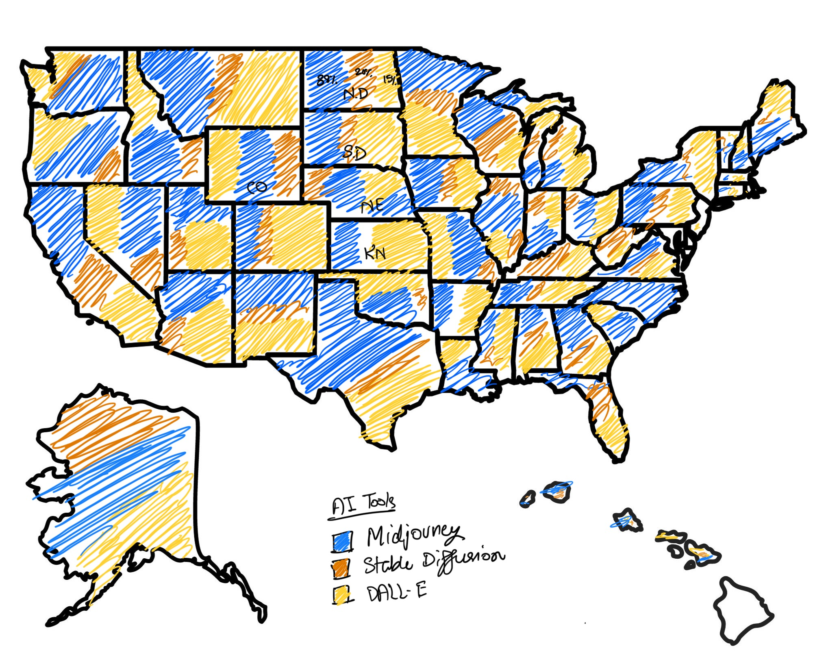

# Assignment: Critique by Design with Tableau (MakeoverMonday)
## Step 1: Choose a data visualization from MakeoverMonday
[Generative AI Search Trends in the United States](https://trends.google.com/trends/explore?date=2022-01-01%202024-02-16&geo=US&q=Midjourney,Stable%20Diffusion,DALL%20E&hl=eng)
Souce: Google Trends

#### Why:
I chose the "Generative AI Search Trends in the United States" visualization from Google Trends because it highlights the growing interest in popular AI image generation tools across different U.S. regions. This topic is timely and relevant as AI tools continue to transform creative industries.
- MidJourney,
- Stable Diffusion, and
- DALL-E

The visualization's use of a geographic map and bar chart allows for quick comparisons, but there are opportunities for improvement in displaying detailed comparisons, enhancing interactivity, and addressing accessibility. These factors make it a compelling choice for a thoughtful critique and redesign.

## Step 2: Critique the data visualization
| **Heuristic**     | **What I Like**                                                                                                                                                                                                                                                                                                         | **What I Dislike**                                                                                                                                                                                                                                                                                                                                                                                                                   | **What I Wish I Saw**                                                                                                                                                                                                                                                                                                                                                                                                                       | **Score (Out of 10)** |
|-------------------|-------------------------------------------------------------------------------------------------------------------------------------------------------------------------------------------------------------------------------------------------------------------------------------------------------------------------|--------------------------------------------------------------------------------------------------------------------------------------------------------------------------------------------------------------------------------------------------------------------------------------------------------------------------------------------------------------------------------------------------------------------------------------|----------------------------------------------------------------------------------------------------------------------------------------------------------------------------------------------------------------------------------------------------------------------------------------------------------------------------------------------------------------------------------------------------------------------------------------------|-----------------------|
| **Usefulness**    | The area map cleanly represents state-by-state interest in AI image generation tools. The bar graph is easy to read, and the distinct colors make differentiating between tools straightforward.   **Why:** This matches the usefulness heuristic by providing a clear overview of how each state’s interest is distributed. By using simple, distinct visuals, the data becomes actionable for stakeholders like marketers or developers wanting to know which regions favor certain tools. | The map gives the impression that only one tool is in use per state (e.g., North Dakota and West Virginia are highlighted in yellow). This hides the fact that all three tools are being used in those states, which reduces insight.   **Why:** This breaks the truthfulness heuristic by oversimplifying the data. It doesn’t show the full picture of usage for each tool and misleads the user into thinking one tool is dominant without showing the scale of dominance. | A stacked bar graph directly on the map or an overlapping representation of tool usage in each state.  **Why:** This would improve completeness and truthfulness, giving a more nuanced and accurate representation of tool usage rather than just highlighting the majority tool. It would also improve usefulness by offering more granular insights, making the data more actionable. | 7 |
| **Completeness**  | The visualization gives a clear overview of which tools are preferred in different states, based on search interest.  **Why:** This meets the completeness heuristic by providing relevant, understandable information. The map gives a useful high-level breakdown, and the bar graph adds detail to help users compare between states.| The x-axis of the bar graph doesn’t display percentages unless you hover over the bars, making it difficult to compare states at a glance. Additionally, the map doesn’t provide a detailed breakdown for each tool in a state, which could confuse users.  **Why:** This violates the perceptibility heuristic because users cannot easily see the precise distribution of interest for each tool. It also violates completeness, as the lack of easily accessible data on the map and bar graph means users miss out on important details. | Percentages labeled directly on the bars and tooltips on the map that show all three tools' percentages for each state, not just the majority one.  **Why:** This would improve completeness by showing all relevant data, not just the dominant tool, and would enhance perceptibility by making comparisons easier without hovering. Users could quickly compare percentages between states or tools without extra effort.| 6 |
| **Perceptibility** | The clean and simple design of the area map and bar graph makes it easy to follow visually.  **Why:** This satisfies the perceptibility heuristic by displaying data in a clear, easy-to-read format, allowing users to quickly scan and absorb the information. | The pop-up tooltip that appears when you hover over a state blocks the state name, making it difficult to identify the state. Additionally, the blue and yellow color scheme implies that only one tool dominates each state, even though multiple tools are in use. .  **Why:** This goes against perceptibility because the tooltip disrupts users' ability to identify states clearly. It also violates truthfulness by implying single-tool dominance and misleading users who want to understand the full usage within each state. | A tooltip that doesn’t block the state name and a color gradient (or pie chart overlay) to show how each tool is used in every state.  **Why:** This would improve perceptibility by making the data easier to access without obscuring essential information (state names). It would also boost truthfulness by showing a proportional breakdown of tool usage in each state, rather than suggesting one tool dominates. | 5 |
| **Truthfulness**   | The data seems accurate in highlighting the most popular tool in each state in Bar Chart.  **Why:** This aligns with the truthfulness heuristic, as the data is presented reliably and reflects actual search interest. | The map gives the impression that only one tool is in use per state (e.g., North Dakota and West Virginia are highlighted in yellow). This hides the fact that all three tools are being used in those states, which reduces insight.  **Why:** This misrepresentation violates truthfulness by oversimplifying the data. Users can’t see the scale of usage for the other tools, leading to an inaccurate understanding of the tool landscape. | More nuanced visual cues (e.g., stacked bars or proportional circles) to show that multiple tools are being used in each state. Also, percentages visible on the bar chart without needing to hover.  **Why:** This would ensure truthfulness and perceptibility by showing a fuller, more accurate picture of tool usage across states and making comparisons clearer. | 6 |
| **Intuitiveness**  | The overall layout is intuitive, with clear labels and distinct colors for each tool.  **Why:** This meets the intuitiveness heuristic because the map and bar chart are familiar formats that make it easy for users to navigate and understand. | The bar graph always places MidJourney at the top, even when other tools are selected for comparison. This makes it harder to compare the data for the other tools.   **Why:** This breaks the intuitiveness heuristic by adding unnecessary cognitive load. The user expects the graph to re-sort when they select a tool for comparison, but it doesn’t, making it more difficult to focus on the tool of interest. | Dynamically sorted bar charts based on the tool selected, and more accessible details when hovering over the bar graph.  **Why:** This would improve intuitiveness and usefulness, allowing users to quickly and easily compare interest in each tool without unnecessary effort or confusion. | 7 |
| **Aesthetics**     | The design is clean and simple, making it easy to focus on the data. The distinct colors—blue, red, and yellow—are clear and immediately help in distinguishing between the different tools. At first glance, the visualization is straightforward and doesn't overwhelm you with too much information.   **Why:**  This works because it keeps the visualization uncluttered and helps users focus on what’s important without getting lost in unnecessary details.| The solid colors used for the states feel a bit too rigid and flat, especially since they only highlight one tool per state. It doesn't show how much more one tool is preferred over the others, which takes away from the depth of the data.  **Why:** Without using a more detailed color palette, the map doesn’t fully capture the differences in interest levels. It ends up feeling a bit static, which might make it less engaging for users who want to explore more nuances. | I’d love to see more variation in the colors—maybe gradients or shading—that could reflect tool dominance in a more dynamic way. Adding some texture or changes in the bar graph design would also help make it more engaging and visually interesting.  **Why:** This would improve both the look and feel of the visualization. It would make the data more engaging and accessible, while still keeping everything clear and easy to understand.| 6 |
| **Engagement**     | The area map and bar graph are engaging, providing users with multiple ways to explore the data.  **Why:** This meets the engagement heuristic by inviting users to interact with the visualization in a way that leads to understanding, encouraging them to explore different states and tools. | The map’s tooltip blocks state names, and percentages in the bar graph are only visible on hover. This makes it harder for users to quickly engage with the data.  **Why:** This breaks engagement and perceptibility heuristics by making users work harder to access the data they need. It discourages deeper interaction and exploration. | A more interactive experience with filters on the map, tooltips that don’t block state names, and visible percentages on the bar graph.  **Why:** This would improve engagement by allowing users to explore the data more seamlessly and enhancing perceptibility by making key data points (like percentages) immediately available. | 7 |

## Step 3: Sketch out a solution
### Sketch 

## Step 4: Test the solution

## Step 5: Build your solution
### Viz 1

The donut chart overlay on the map provides geographic context to the AI tool usage data. By displaying the data directly on a map, users can easily identify regional trends and see how each AI tool (MidJourney, Stable Diffusion, DALL-E) is used within specific states. The donut slices visually represent the proportional usage of each tool, making it intuitive to identify which tools are most popular in different regions.

Interaction Features:
- **Hover Over for State Name:** Users can hover over the white center of each donut to reveal the state’s name, ensuring easy identification of each geographic region.
- **Hover Over for Tool Usage:** Users can hover over the colored sections of the donut to see the percentage usage of each AI tool (blue for MidJourney, red for Stable Diffusion, yellow for DALL-E). This feature provides a clear breakdown of tool preferences within each state.
  
### Viz 2

The stacked bar chart provides a clear visual comparison of AI tool usage across different U.S. states. The stacked layout allows users to see the proportion of each tool's usage (Midjourney, Stable Diffusion, DALL-E) in each state, making it easy to compare how these tools are used on a state-by-state basis. The horizontal layout keeps the comparison organized and concise.

Interaction Features:
- **Clicking on Colors:** Users can interact with the chart by selecting individual tool colors on the bar. This feature allows users to filter the chart by the selected tool, instantly reorganizing the chart to highlight the chosen tool. The selected tool will appear first in the bar distribution across all states, making it easier to focus on how the tool performs regionally.
- **X-Axis Percentages:** The X-axis is labeled with percentages, helping users to easily interpret the data proportions, showing the popularity of each tool as a percentage of the total across all states.
  
Video Reference: [#WatchMeViz Generative AI Search Trends in the United States](https://www.youtube.com/watch?v=-w0ynF43yZg&list=PLX-uPHRG0cLb697Ie-ZGSObRLLNhxzJGK&index=11)
