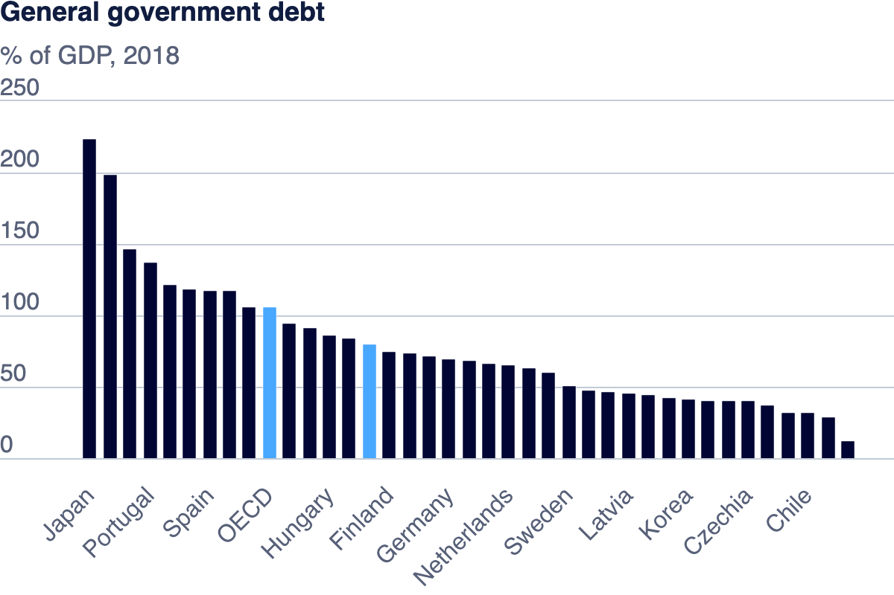

# Data Viz
## Part 1: Working with web-based visualization tools and data

## Part 2: Working with Tableau 

<noscript></noscript><object class='tableauViz'  style='display:none;'><param name='host_url' value='https%3A%2F%2Fpublic.tableau.com%2F' /> <param name='embed_code_version' value='3' /> <param name='site_root' value='' /><param name='name' value='Part3OECDDataset&#47;Part2OECDDataSet' /><param name='tabs' value='no' /><param name='toolbar' value='yes' /><param name='static_image' value='https:&#47;&#47;public.tableau.com&#47;static&#47;images&#47;Pa&#47;Part3OECDDataset&#47;Part2OECDDataSet&#47;1.png' /> <param name='animate_transition' value='yes' /><param name='display_static_image' value='yes' /><param name='display_spinner' value='yes' /><param name='display_overlay' value='yes' /><param name='display_count' value='yes' /><param name='language' value='en-US' /><param name='filter' value='publish=yes' /></object>
             

You can explore the interactive **Debt-to-GDP Heat Map** using this [link to the Tableau visualization](https://public.tableau.com/views/Part3OECDDataset/Part2OECDDataSet?:language=en-US&publish=yes&:sid=&:redirect=auth&:display_count=n&:origin=viz_share_link).

## Part 3: Create your own visualization

<noscript></noscript><object class='tableauViz'  style='display:none;'><param name='host_url' value='https%3A%2F%2Fpublic.tableau.com%2F' /> <param name='embed_code_version' value='3' /> <param name='path' value='shared&#47;5MJHW7DT7' /> <param name='toolbar' value='yes' /><param name='static_image' value='https:&#47;&#47;public.tableau.com&#47;static&#47;images&#47;5M&#47;5MJHW7DT7&#47;1.png' /> <param name='animate_transition' value='yes' /><param name='display_static_image' value='yes' /><param name='display_spinner' value='yes' /><param name='display_overlay' value='yes' /><param name='display_count' value='yes' /><param name='language' value='en-US' /><param name='filter' value='publish=yes' /></object>
              

You can explore the interactive **Debt-to-GDP Ratio Trends by Country (1995–2019)** using this [link to the Tableau visualization](https://public.tableau.com/shared/W3DM6SR45?:display_count=n&:origin=viz_share_link).

## Comparing Visualization Methods

In this assignment, I used three different visualizations to explore government debt-to-GDP ratios: a bar chart, a heat map, and a line graph. Each visualization has its own strengths for presenting the data.

#### Part 1: Bar Chart:
The bar chart is ideal for comparing government debt across countries for a specific year. It offers a clear side-by-side comparison, making it easy to identify which countries had higher or lower debt in that particular year. However, the bar chart is limited when it comes to showing trends over time, as it only represents one year at a time.

#### Part 2: Heat Map:
The heat map provides an overview of debt-to-GDP ratios over several years. Using color to represent debt levels, it helps identify patterns and outliers across multiple countries and years. This makes it useful for spotting overall trends. However, it doesn’t give precise details about changes from one year to the next and can be harder to interpret for exact values.

#### Part 3: Line Graph (Final Visualization):
I chose the line graph as my final visualization because it’s the most effective at showing how debt-to-GDP ratios change over time. I also added **country labels** at the end of each line to make it easy for users to identify which line corresponds to each country. The Y-axis was renamed to **"Government Debt as Percentage of GDP (%)"** to make it more descriptive and help users understand the metric more clearly.

The line graph also includes a **dynamic title** and a **short paragraph** explaining how users can interact with the filters for region and year. This interactivity enables users to easily focus on specific regions or time periods, which enhances their exploration of the data and makes it easier to spot trends and changes over time.

### Conclusion:
The bar chart is best for single-year comparisons, the heat map shows broad patterns, and the line graph excels at showing long-term trends. I selected the line graph as the final visualization because it provides the clearest and most useful insights into how debt levels evolve over time. The added labels, axis description, and interactive elements help guide the user to a more engaging and informative exploration of the data.
