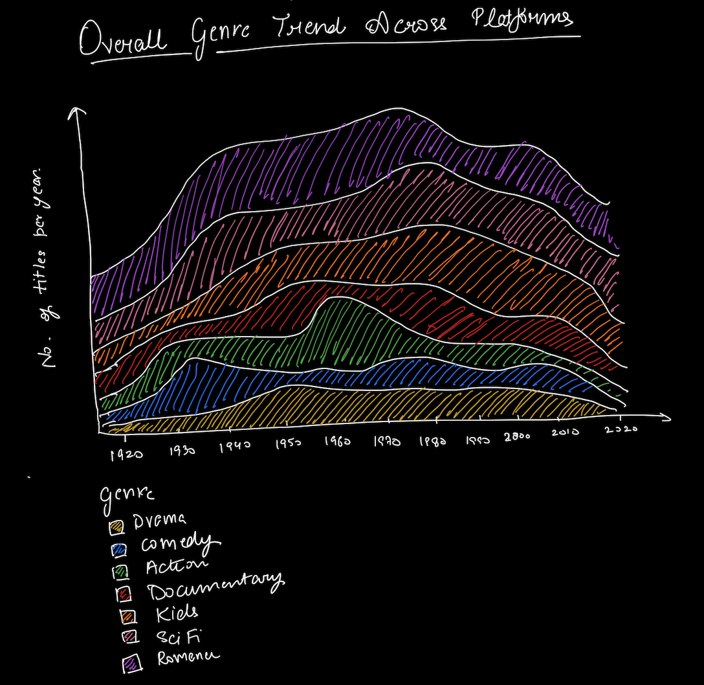
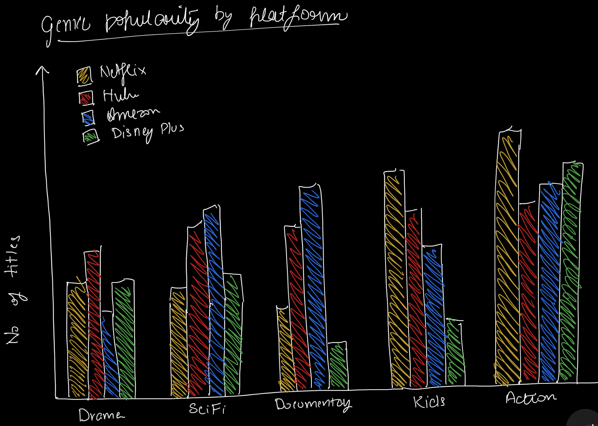
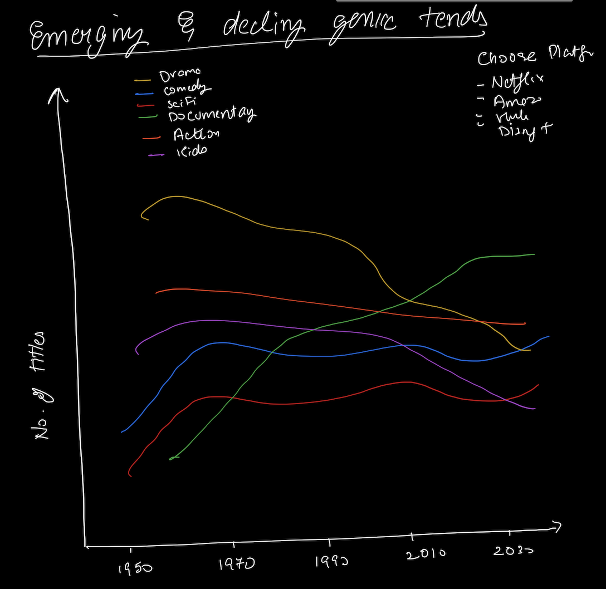

# Final Project: Content Wars: How Streaming Giants Tailor Genres to Captivate Their Audiences
---
## Part I
--- 
## Outline
### Context and Background: 
Streaming platforms have changed the way we consume content. With an overwhelming number of options from platforms like Amazon Prime, Disney Plus, Hulu, and Netflix, the challenge for binge-watchers isn’t just what to watch, but where to watch it. This project analyzes how each platform curates its content by genre, helping viewers make informed decisions about which platform best aligns with their favorite genres.

### Why This Topic? 
**Personal Motivation:** I’ve always been fascinated by the power of stories and how they can shape our perspectives. As an avid viewer, I often wonder why I’m drawn to certain shows and movies on different platforms. Why do I find myself binge-watching dramas on Netflix but switch to documentaries on Amazon Prime? This project is my way of answering those questions. It’s personal because I’m trying to understand my own viewing habits and the subtle ways these platforms influence what I choose to watch.

**Professional Relevance:** In my professional journey, I’ve been involved in roles that mix technology, data, and design. This project lets me bring all these interests together. By analyzing how platforms use data to shape their content strategies, I’m not just satisfying my curiosity—I’m also building skills that are relevant for a career in tech or media. It’s a way for me to connect the dots between my love for storytelling and my interest in data-driven decision-making.

### Reader's Perspective:
#### Understanding the Reader’s Needs:
- **As a reader, I want to** find out which platform—Amazon Prime, Disney Plus, Hulu, or Netflix—offers the most content in my favorite genres **so that I can** quickly decide where to subscribe and watch without spending time browsing across different services.

#### Call to Action:
- **As a reader, I want to** use the data and insights from this project to identify which platform—Amazon Prime, Disney Plus, Hulu, or Netflix—offers the most content in my favorite genres **so that I can** make an informed decision about where to subscribe and stream next. **I can do this by** exploring the genre breakdowns and platform comparisons provided in the visualizations to quickly see which service aligns with my preferences.

#### Reader Journey Map:

### Purpose & Significance:
This project is designed to help both **normal viewers** and **binge-watchers** easily find out which streaming platform—**Amazon Prime, Disney Plus, Hulu, or Netflix**—offers the most content in their favorite genres. By analyzing how genre trends have evolved over time, it reveals the strategic curation that each platform uses to attract and retain its audience.

Understanding these genre strategies is valuable for viewers for several reasons:
- **For Normal Viewers:** To quickly discover which platform has the best selection of their favorite genres, making it easier to choose where to watch next.
- **For Binge-Watchers:** To identify the platform that offers the deepest library of their preferred genres, maximizing their streaming experience.

By the end of this project, you'll have a clear understanding of **which platform to choose** based on your genre preferences, allowing you to make smarter streaming decisions and enjoy more of the content you love.

---
  
## Sketches
### Sketch 1: Overall Genre Trend Across Platforms (Stacked Area Chart)

#### Purpose: 
This visualization is designed to illustrate how genre trends have evolved over time across streaming platforms, providing insights into the shifting popularity of key genres like Drama, Comedy, Action, Documentary, and others. By tracking the number of titles released per genre from 1920 to 2021, the chart helps viewers understand how each platform has adjusted its content strategy to cater to changing audience preferences.

#### Why I’ve Chosen This Visualization:
A stacked area chart effectively highlights both the overall growth of content and the shifting prominence of individual genres, offering a clear view of how platform strategies and genre focus have evolved over the decades.

### Sketch 2: Genre Popularity by Platform (Grouped Bar Chart)

#### Purpose: 
This visualization compares the popularity of genres across different streaming platforms—Netflix, Hulu, Amazon Prime, and Disney Plus—to reveal which platform offers the most content in each genre. It focuses on key genres like Drama, Sci-Fi, Documentaries, Kids, and Action.
#### Why I’ve Chosen This Visualization:
A grouped bar chart allows for a clear, side-by-side comparison of how each platform stacks up in specific genres. It visually highlights the differences in content offerings, making it easy to see which platform excels in particular genres, helping viewers make more informed decisions about where to watch based on their preferences.

### Sketch 3: Emerging and Declining Genre Trends (Multi-Line Graph)

#### Purpose: 
This visualization shows the emerging and declining trends of various genres. By tracking the number of titles in each genre over the decades, it highlights which genres are gaining or losing popularity on various streaming platforms.

#### Why I’ve Chosen This Visualization:
A multi-line graph is ideal for showing trends over time, allowing viewers to see the rise or decline of different genres at a glance. This format helps viewers understand how platforms have shifted their focus on certain genres over the years, giving a clear view of long-term genre dynamics and helping them make better choices about which platforms align with their genre preferences.

---

## Data
### Original Data Sources
The datasets used in this project were sourced from Kaggle. You can find the original data at the following links:

- [Netflix Shows Dataset on Kaggle](https://www.kaggle.com/datasets/shivamb/netflix-shows)
- [Amazon Prime Movies and TV Shows Dataset on Kaggle](https://www.kaggle.com/datasets/shivamb/amazon-prime-movies-and-tv-shows)
- [Hulu Movies and TV Shows Dataset on Kaggle](https://www.kaggle.com/datasets/shivamb/hulu-movies-and-tv-shows)
- [Disney Movies and TV Shows Dataset on Kaggle](https://www.kaggle.com/datasets/shivamb/disney-movies-and-tv-shows)
- [Netflix Titles CSV](https://raw.githubusercontent.com/singhvidushi/portfolio/refs/heads/main/netflix_titles.csv)
- [Hulu Titles CSV](https://raw.githubusercontent.com/singhvidushi/portfolio/refs/heads/main/hulu_titles.csv)
- [Disney Plus Titles CSV](https://raw.githubusercontent.com/singhvidushi/portfolio/refs/heads/main/disney_plus_titles.csv)
- [Amazon Prime Titles CSV](https://raw.githubusercontent.com/singhvidushi/portfolio/refs/heads/main/amazon_prime_titles.csv)

These datasets were used to analyze and visualize genre trends and platform strategies across different streaming services.

### Project Data
The cleaned and processed datasets used for this project are available for download:

- [Streaming Data CSV](https://raw.githubusercontent.com/singhvidushi/portfolio/refs/heads/main/streaming_data_cleaned.csv))
- [Python File](app.py)

---

## Method & Medium

This project uses various tools for data analysis, visualization, and presentation, divided into three stages: data preparation, visualization, and presentation.

### 1. Data Preparation
**Tools:** Excel, Python  
- **Data Cleaning:** Using Excel and Python to handle missing values, standardize genre names, and merge datasets from Kaggle.
- **Data Analysis:** Preliminary analysis with Pandas and NumPy to explore the data structure and trends.

### 2. Data Visualization
**Tools:** Tableau, Flourish  
- **Interactive Visualizations:** Tableau will create stacked area charts, grouped bar charts, and multi-line graphs showing genre evolution and platform strategies.
- **Flourish for Pie Charts:** Flourish will be used to create pie charts for clear distribution visualization.
- **Customization:** Filters for genres, platforms, and years, with tooltips and annotations to highlight insights.

### 3. Presentation
**Tool:** Shorthand  
- **Narrative:** Visualizations will be embedded in Shorthand to create an engaging story that highlights trends and insights.

