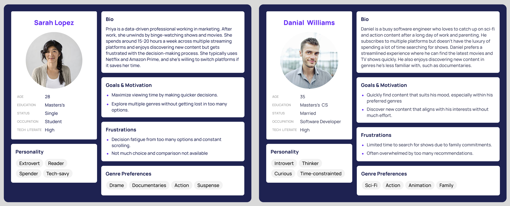

# Final Project: Content Wars: How Streaming Giants Tailor Genres to Captivate Their Audiences
---
## Part II
---
## Wireframes and storyboards:

### **Story Flow:**

#### **1. Introduction: The Time We Spend Watching TV and Movies**
   > **Opening**:  
   > In today's world, we spend countless hours glued to our screens, binge-watching TV shows and movies. On average, people spend over 20 hours a week watching their favorite content on streaming platforms.
  
#### **2. The Hidden Time Drain: Deciding What to Watch**
   > **Highlight the Problem**:  
   > Discuss the time viewers spend scrolling through streaming services, people often spend 15-20 minutes deciding what to watch.  

   > Visualization to emphasize the overwhelming options that viewers face when deciding what to watch.

<noscript></noscript><object class='tableauViz'  style='display:none;'><param name='host_url' value='https%3A%2F%2Fpublic.tableau.com%2F' /> <param name='embed_code_version' value='3' /> <param name='site_root' value='' /><param name='name' value='PlatformComparisonNumberofUniqueTitlesperGenre&#47;Sheet1' /><param name='tabs' value='no' /><param name='toolbar' value='yes' /><param name='static_image' value='https:&#47;&#47;public.tableau.com&#47;static&#47;images&#47;Pl&#47;PlatformComparisonNumberofUniqueTitlesperGenre&#47;Sheet1&#47;1.png' /> <param name='animate_transition' value='yes' /><param name='display_static_image' value='yes' /><param name='display_spinner' value='yes' /><param name='display_overlay' value='yes' /><param name='display_count' value='yes' /><param name='language' value='en-US' /><param name='filter' value='publish=yes' /></object>
               

#### **3. How My Project Helps** 
   > I will use data from Netflix, Amazon Prime, Hulu, and Disney Plus to help viewers make informed choices.
   > Heatmap of Unique Titles per Genre Across Platforms to present the distribution of genres across platforms. 

<noscript></noscript><object class='tableauViz'  style='display:none;'><param name='host_url' value='https%3A%2F%2Fpublic.tableau.com%2F' /> <param name='embed_code_version' value='3' /> <param name='path' value='shared&#47;X68N7D239' /> <param name='toolbar' value='yes' /><param name='static_image' value='https:&#47;&#47;public.tableau.com&#47;static&#47;images&#47;X6&#47;X68N7D239&#47;1.png' /> <param name='animate_transition' value='yes' /><param name='display_static_image' value='yes' /><param name='display_spinner' value='yes' /><param name='display_overlay' value='yes' /><param name='display_count' value='yes' /><param name='language' value='en-US' /><param name='filter' value='publish=yes' /></object>
         

Through comprehensive data analysis, I’ve looked at the genre offerings on each platform and how they’ve evolved over time. Whether you're into drama, sci-fi, documentaries, or kids' shows, my visualizations will show you which platform has the most content in your favorite genres.

#### **4. Dynamic Genre Dashboard Overview**
In a world where content is endless, time shouldn’t be wasted figuring out where to watch. Let this data guide your streaming journey and ensure that you’re watching what you love on the platform that suits you best.
> The **Dynamic Genre Dashboard** allows users to select any genre, such as Comedy, Drama, Action, or others, and see how streaming platforms compare in terms of content offerings. The dashboard is interactive, featuring several key sections:
> 
> - **Bar Chart for Genre Titles**: This bar chart updates based on the selected genre, displaying the total number of titles available on Netflix, Amazon Prime, Hulu, and Disney+. It helps users quickly identify which platform has the most content for their chosen genre.
> 
> - **Treemap for Platform Prioritization**: This treemap highlights the percentage share of the selected genre within each platform's overall content library. It helps users understand how much focus each platform places on that genre relative to others.
> 
> - **Line Graph for Genre Evolution**: This line graph shows how the selected genre’s content has evolved over time across platforms. It provides users with insights into historical trends and growth for that genre on Netflix, Hulu, Disney+, and Amazon Prime.

> By selecting different genres, users can easily explore which platform best suits their preferences and make more informed viewing decisions.

<noscript></noscript><object class='tableauViz'  style='display:none;'><param name='host_url' value='https%3A%2F%2Fpublic.tableau.com%2F' /> <param name='embed_code_version' value='3' /> <param name='path' value='shared&#47;NQZCP8C96' /> <param name='toolbar' value='yes' /><param name='static_image' value='https:&#47;&#47;public.tableau.com&#47;static&#47;images&#47;NQ&#47;NQZCP8C96&#47;1.png' /> <param name='animate_transition' value='yes' /><param name='display_static_image' value='yes' /><param name='display_spinner' value='yes' /><param name='display_overlay' value='yes' /><param name='display_count' value='yes' /><param name='language' value='en-US' /><param name='filter' value='publish=yes' /></object>
            

---

## **User Research and Interviews**

For this part of the project, I developed a user research protocol to gather insights from three different individuals who represent my target audience. The goal of this research is to ensure that the visualizations effectively convey the story and help viewers make informed decisions about their streaming platform preferences.

### **A. Target Audience**
The target audience includes viewers who regularly stream content across platforms like Netflix, Amazon Prime, Hulu, and Disney+. The specific personas being considered are:

- **Sarah Lopez:** A 28-year-old student who binge-watches a variety of genres (Drama, Documentaries, Action, Suspense) and experiences decision fatigue due to the overwhelming number of options.
- **Daniel Williams:** A 35-year-old software engineer who prefers Sci-Fi, Action, Animation, and Family genres. With a time-constrained schedule, he seeks content quickly and values efficiency in his decisions.

### **B. Approach to Identifying Interviewees**
The representative individuals for the interviews are selected based on their viewing habits and challenges:

- Students: Individuals like Sarah Lopez who juggle academic commitments with entertainment and rely on streaming platforms to relax.
- Working Professionals: People like Daniel Williams, who balance work and family responsibilities, and prefer an efficient decision-making process when choosing content to watch.

I will reach out to people in these groups who share similar viewing habits and frustrations to understand their perspectives.
  
### **C. Interview Script & Responses**
| **Question**                                         | **Interviewee 1 (Sarah Lopez Persona)**                         | **Interviewee 2 (Sarah Lopez Persona)**                        | **Interviewee 3 (Daniel Williams Persona)**                     |
|------------------------------------------------------|----------------------------------------------------------------|----------------------------------------------------------------|----------------------------------------------------------------|
| **Can you tell me what you think this is?**          | It looks like a tool to compare content across streaming platforms by genre. | It’s showing how different genres are distributed across streaming platforms. | It seems like a guide to help me figure out which platform has more of the content I like. |
| **Can you describe what this is telling you?**       | It shows which platform has more content in the genre I’m interested in. | It’s comparing how many titles of different genres are available on each platform. | This tells me which platform focuses on specific genres, making it easier to choose where to watch. |
| **Is there anything you find surprising or confusing?** | It’s not immediately clear how I can use it to quickly make a decision. Maybe a filter or highlight feature would help. | I wish there was a way to compare genres side by side, like a ranking system to see which platform is best for specific genres. | The interface is simple, but I would prefer if it could tell me what’s new or trending in my favorite genres. |
| **Who do you think is the intended audience for this?** | People like me who watch a lot of shows and movies but want to find what to watch quickly. | It’s for anyone who subscribes to multiple streaming services and needs help navigating the content. | It seems aimed at people who don’t have a lot of time but want to get straight to the point of finding what to watch. |
| **What part of the visualization do you find most useful?** | The bar chart is helpful for seeing how much content there is, but I’d like it to be more interactive. | The heatmap is the most useful because it shows exactly which platform has what content for each genre. | The dashboard that lets you pick genres is the best part; it’s easy to filter by my interests. |
| **Is there anything you would change or do differently?** | I’d add more filters and a recommendation section to make the decision process faster. | I would like more personalized suggestions based on my viewing history. | I’d improve the UI so I can quickly toggle between platforms, or even add new features that show trending genres. |
| **Do you think the colors used in the chart are helpful?** | The colors are fine, but I think using gradients might help make the differences clearer. | They’re distinct enough, but they could be more vibrant, especially for the genres I watch. | I like the colors, but it might be better if they represented trends over time, like a color scale for growth. |
| **Would you prefer another type of chart or representation?** | A comparison or ranking view would be more helpful for quick decisions. | A recommendation engine or genre ranking might be better than just showing the data. Maybe something like a pie chart for clarity. | The line graphs and bar charts work well, but I’d prefer a system that shows top picks for each genre. |

### **D. Findings & Planned Changes Based on Feedback**

1. **Enhance Filter Functionality**:
   - **Feedback**: Users wanted more intuitive use of the filters for quicker decisions, though they are already present.
   - **What Can Be Done**: Highlight the filter feature more prominently in the dashboard's interface and provide tooltips or instructions on how to best use them for faster navigation.

2. **Ranking or Comparison Feature**:
   - **Feedback**: Participants mentioned the absence of a ranking system or a way to see trending content.
   - **What Can Be Done**: Introduce a ranking feature based on genre popularity or a "Top Titles" section to show trending or top-rated content.

3. **Visual Design**:
   - **Feedback**: While the color scheme was appreciated, some users suggested adding gradient colors for better visual differentiation between platforms.
   - **What Can Be Done**: Implement gradient color schemes to make comparisons between platforms more intuitive and visually appealing.

4. **Highlighting Platform Strengths**:
   - **Feedback**: Users suggested adding an overview of what each platform excels in, like a "Platform Strengths" summary for quick insights.
  
---

## Data
### Original Data Sources
The datasets used in this project were sourced from Kaggle. You can find the original data at the following links:

- [Netflix Shows Dataset on Kaggle](https://www.kaggle.com/datasets/shivamb/netflix-shows)
- [Amazon Prime Movies and TV Shows Dataset on Kaggle](https://www.kaggle.com/datasets/shivamb/amazon-prime-movies-and-tv-shows)
- [Hulu Movies and TV Shows Dataset on Kaggle](https://www.kaggle.com/datasets/shivamb/hulu-movies-and-tv-shows)
- [Disney Movies and TV Shows Dataset on Kaggle](https://www.kaggle.com/datasets/shivamb/disney-movies-and-tv-shows)
- [Netflix Titles CSV](https://raw.githubusercontent.com/singhvidushi/portfolio/refs/heads/main/netflix_titles.csv)
- [Hulu Titles CSV](https://raw.githubusercontent.com/singhvidushi/portfolio/refs/heads/main/hulu_titles.csv)
- [Disney Plus Titles CSV](https://raw.githubusercontent.com/singhvidushi/portfolio/refs/heads/main/disney_plus_titles.csv)
- [Amazon Prime Titles CSV](https://raw.githubusercontent.com/singhvidushi/portfolio/refs/heads/main/amazon_prime_titles.csv)

These datasets were used to analyze and visualize genre trends and platform strategies across different streaming services.

### Project Data
The cleaned and processed datasets used for this project are available for download:

- [Streaming Data CSV](https://raw.githubusercontent.com/singhvidushi/portfolio/refs/heads/main/streaming_data_cleaned.csv))
- [Python File](app.py)
