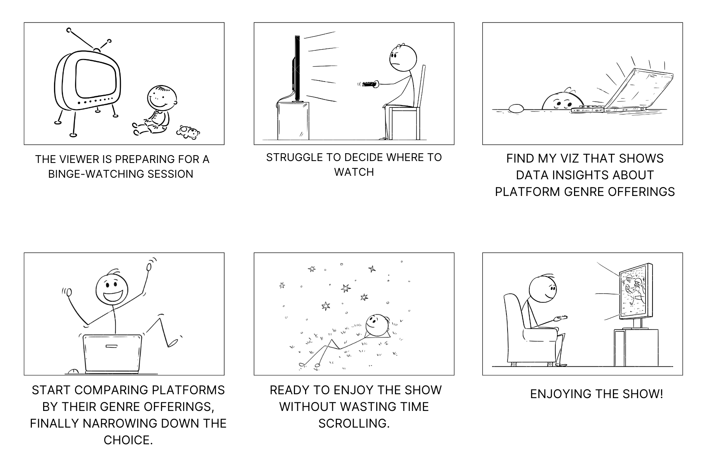

# Final Project: Content Wars: How Streaming Giants Tailor Genres to Captivate Their Audiences
## Part II
  
## Wireframes and storyboards:

### **Story Flow:**

#### **1. Introduction: The Time We Spend Watching TV and Movies**
   > **Opening**:  
   > I will begin by highlighting the average time people spend watching TV and movies( about 20 hours per week) and the growing realiance on streaming platforms in everyday life.
  
#### **2. The Hidden Time Drain: Deciding What to Watch**
   > **Highlight the Problem**:  
   > Discuss the time viewers spend scrolling through streaming services, people often spend 15-20 minutes deciding what to watch.  

   > Visualization to emphasize the overwhelming options that viewers face when deciding what to watch.

<noscript></noscript><object class='tableauViz'  style='display:none;'><param name='host_url' value='https%3A%2F%2Fpublic.tableau.com%2F' /> <param name='embed_code_version' value='3' /> <param name='site_root' value='' /><param name='name' value='PlatformComparisonNumberofUniqueTitlesperGenre&#47;Sheet1' /><param name='tabs' value='no' /><param name='toolbar' value='yes' /><param name='static_image' value='https:&#47;&#47;public.tableau.com&#47;static&#47;images&#47;Pl&#47;PlatformComparisonNumberofUniqueTitlesperGenre&#47;Sheet1&#47;1.png' /> <param name='animate_transition' value='yes' /><param name='display_static_image' value='yes' /><param name='display_spinner' value='yes' /><param name='display_overlay' value='yes' /><param name='display_count' value='yes' /><param name='language' value='en-US' /><param name='filter' value='publish=yes' /></object>
               

#### **3. How My Project Helps** 
   > I will use data from Netflix, Amazon Prime, Hulu, and Disney Plus to help viewers make informed choices.
   > Heatmap of Unique Titles per Genre Across Platforms to present the distribution of genres across platforms. Highlight key genres, demonstrating how viewers can use this data to pinpoint the best platform for their favorite content.

<noscript></noscript><object class='tableauViz'  style='display:none;'><param name='host_url' value='https%3A%2F%2Fpublic.tableau.com%2F' /> <param name='embed_code_version' value='3' /> <param name='path' value='shared&#47;X68N7D239' /> <param name='toolbar' value='yes' /><param name='static_image' value='https:&#47;&#47;public.tableau.com&#47;static&#47;images&#47;X6&#47;X68N7D239&#47;1.png' /> <param name='animate_transition' value='yes' /><param name='display_static_image' value='yes' /><param name='display_spinner' value='yes' /><param name='display_overlay' value='yes' /><param name='display_count' value='yes' /><param name='language' value='en-US' /><param name='filter' value='publish=yes' /></object>
         

#### **4. Dynamic Genre Dashboard Overview**
> The **Dynamic Genre Dashboard** allows users to select any genre, such as Comedy, Drama, Action, or others, and see how streaming platforms compare in terms of content offerings. The dashboard is interactive, featuring several key sections:
> 
> - **Bar Chart for Genre Titles**: This bar chart updates based on the selected genre, displaying the total number of titles available on Netflix, Amazon Prime, Hulu, and Disney+. It helps users quickly identify which platform has the most content for their chosen genre.
> 
> - **Treemap for Platform Prioritization**: This treemap highlights the percentage share of the selected genre within each platform's overall content library. It helps users understand how much focus each platform places on that genre relative to others.
> 
> - **Line Graph for Genre Evolution**: This line graph shows how the selected genre’s content has evolved over time across platforms. It provides users with insights into historical trends and growth for that genre on Netflix, Hulu, Disney+, and Amazon Prime.

> By selecting different genres, users can easily explore which platform best suits their preferences and make more informed viewing decisions.

<noscript></noscript><object class='tableauViz'  style='display:none;'><param name='host_url' value='https%3A%2F%2Fpublic.tableau.com%2F' /> <param name='embed_code_version' value='3' /> <param name='path' value='shared&#47;NQZCP8C96' /> <param name='toolbar' value='yes' /><param name='static_image' value='https:&#47;&#47;public.tableau.com&#47;static&#47;images&#47;NQ&#47;NQZCP8C96&#47;1.png' /> <param name='animate_transition' value='yes' /><param name='display_static_image' value='yes' /><param name='display_spinner' value='yes' /><param name='display_overlay' value='yes' /><param name='display_count' value='yes' /><param name='language' value='en-US' /><param name='filter' value='publish=yes' /></object>
            

