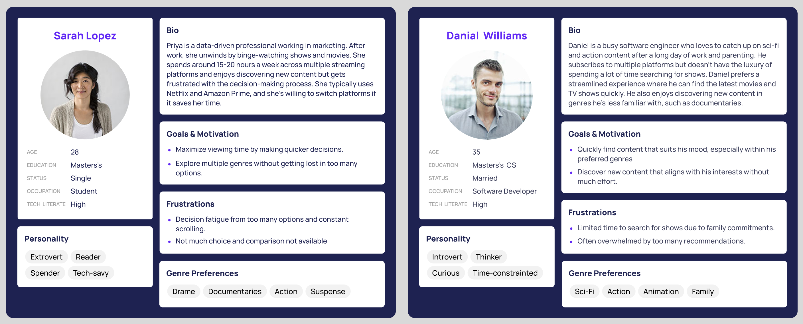

# Final Project: Content Wars: How Streaming Giants Tailor Genres to Captivate Their Audiences
---
## Part III: Final Deliverable and Presentation
---
## Audience
The intended audience for this project includes **binge-watchers** and **regular viewers** who regularly stream content from multiple platforms like **Netflix, Amazon Prime, Hulu,** and **Disney+**. These users often face decision fatigue when deciding what to watch and where to find their preferred genres. Therefore, the dashboard was designed with these personas in mind to simplify their decision-making process.

### Personas Used:
- **Binge-Watchers**: This group watches several episodes or movies in one sitting. They are primarily concerned with finding platforms that offer a wide selection of titles in their preferred genres.
- **Regular Viewers**: These users watch content on a more moderate basis but still need quick access to platform recommendations tailored to their interests. They are looking for the most efficient way to choose the right streaming service for specific genres.

#### Feedback from UX Designer

In the final portion of my project, I gathered feedback from people outside of my original personas to see if the dashboard was intuitive and easy to use. The goal was to ensure that users could understand the insights and interact with the dashboard effectively. 
- **Improved Clarity**: He suggested that the dashboard's headers and descriptions needed more clarity to help users immediately understand the purpose and navigate the content effectively.

- **Shorthand Presentation Enhancements**: Feedback pointed to enhancing the visuals within Shorthand, recommending better use of **contrast** and **typography** for easier readability.
- 
---

## Changes After Part II

Based on feedback from designers and users, I implemented the following changes:

- **Movie/TV Show Recommendations**: I added a feature that recommends 3 specific titles based on the genre the user selects. This makes the dashboard more interactive and provides personalized suggestions, helping users make quicker decisions.
  
- **Dark Mode**: Since many users binge-watch content at night, they suggested that white backgrounds were too straining for their eyes. In response, I added a **dark mode** to the dashboard, with a button at the top-right corner to toggle between day and night modes.
- **Distribution of Genres Across Platforms**: I made edits to this visualization to include a **filter** where users can now choose between **content types**—either **movies** or **TV shows**. This filter allows users to drill down into the type of content they are most interested in, making the dashboard more customizable and relevant to their viewing preferences.

- **Descriptive Header**: I revised the header to provide more clarity and context. The original text was adjusted to better communicate the purpose of the dashboard:

  **Before:**
  _Stream Smart: Discover the Best Platforms for Your Favorite Genres!_
  
  *Curious about where to stream your favorite genres? This dashboard breaks down the top streaming platforms — Netflix, Amazon Prime, Hulu, and Disney+ , showing you the number of titles available, the percentage share each platform holds for specific genres, and trends over time. Use the filters to explore which platform dominates in your favorite category and make your next binge-watch decision easier!*

  **After:**
  _Stream Smart: Discover the Best Platforms for Your Favorite Genres!_

  *Explore how top streaming platforms like Netflix, Amazon Prime, Hulu, and Disney+ stack up in offering your favorite content genres. Dive into the data to see platform preferences, track content trends over time, and get recommendations based on your selection. Make smarter streaming decisions with insights tailored to your viewing tastes!*

### Final Dashboard

<noscript></noscript><object class='tableauViz'  style='display:none;'><param name='host_url' value='https%3A%2F%2Fpublic.tableau.com%2F' /> <param name='embed_code_version' value='3' /> <param name='site_root' value='' /><param name='name' value='FindYourPerfectStreamDiscoverWhichPlatformsOffertheBestGenreChoices&#47;Final' /><param name='tabs' value='no' /><param name='toolbar' value='yes' /><param name='static_image' value='https:&#47;&#47;public.tableau.com&#47;static&#47;images&#47;Fi&#47;FindYourPerfectStreamDiscoverWhichPlatformsOffertheBestGenreChoices&#47;Final&#47;1.png' /> <param name='animate_transition' value='yes' /><param name='display_static_image' value='yes' /><param name='display_spinner' value='yes' /><param name='display_overlay' value='yes' /><param name='display_count' value='yes' /><param name='language' value='en-US' /><param name='filter' value='publish=yes' /></object>
              

---

## What I Learned

This project gave me the opportunity to explore various tools and learn more about user behavior. Here are the key takeaways:

- **Tools Used**:
  - **Shorthand**: A great tool for presenting stories creatively. I used Shorthand to build an engaging and interactive narrative around the data.
  - **Flourish**: Helped me create interactive graphs that made the data more digestible for users.
  - **Tableau Dashboard**: This was instrumental in making the data interactive, allowing users to explore genre trends and platform preferences.

- **User Behavior and Insights**:
  - **Viewing Habits**: I discovered that users, on average, spend **3 hours a day** watching TV and about **30 minutes** simply deciding what to watch. This insight underscored the importance of creating a tool that can streamline the decision-making process, making it faster and easier for users to find the content they love.
  - **Decision Fatigue**: The **30 minutes** spent deciding what to watch highlights the overwhelming choices users face across multiple platforms. This reinforced the need for my dashboard to simplify platform comparison by genre, saving time and reducing decision fatigue.
  - **Dark Mode for Comfortable Viewing**: Based on user feedback, I learned that many users binge-watch content at night, making white backgrounds visually straining in low-light conditions. Dark mode enhances the overall user experience by reducing eye strain, allowing users to explore the data comfortably in any lighting environment, particularly during late-night streaming sessions.

  
- **Platform Preferences**: I also discovered that many streaming platforms have a perticular genre they focus on:
  - **Disney+**: Primarily focuses on family content.
  - **Netflix**: International content is a significant focus area.
  - **Amazon Prime**: Drama dominates the content library.
  - **Hulu**: Has a strong focus on drama and reality TV.

By integrating these findings, I was able to refine the dashboard to cater to users' content preferences more effectively, and ensure that the visualizations and features helped users make smarter decisions about their viewing habits.

---

## Reflection and Final Thoughts

Completing this project has been an enriching experience that blended my interests in storytelling, data analysis, and user experience design. By analyzing how streaming platforms curate their content by genre, I not only deepened my understanding of content strategies but also honed my skills in data visualization and interactive dashboard design.

The feedback from UX designers was instrumental in refining the visual and interactive aspects of my project, ensuring that the final deliverables are both aesthetically pleasing and functionally effective. This iterative process underscored the importance of user-centered design and the value of incorporating diverse perspectives to enhance the overall quality of the work.

Moving forward, I aim to apply these insights to future projects, continuing to prioritize user experience and data-driven storytelling to create impactful and engaging content.

---

## Final Deliverables

1. **GitHub Repository**: [Link to GitHub Repository](https://github.com/singhvidushi/portfolio/tree/main)
   - This repository includes all the work done thus far, organized and documented to provide a behind-the-scenes look at the project’s development. It contains links to the datasets, code used for data processing, and any other relevant resources.

2. **Final Data Story on Shorthand**: [Link to Final Data Story](https://carnegiemellon.shorthandstories.com/stream-smart/index.html)
   - The final data story is published on Shorthand, presenting an engaging narrative complemented by interactive visualizations. This publicly accessible asset showcases the comprehensive analysis and insights derived from the project.

---

## Citations and References

All datasets, images, and external materials used in this project have been appropriately cited to ensure compliance with copyright laws and academic integrity standards. Below are the references:

- **Datasets**:
  - [Netflix Shows Dataset on Kaggle](https://www.kaggle.com/datasets/shivamb/netflix-shows)
  - [Amazon Prime Movies and TV Shows Dataset on Kaggle](https://www.kaggle.com/datasets/shivamb/amazon-prime-movies-and-tv-shows)
  - [Hulu Movies and TV Shows Dataset on Kaggle](https://www.kaggle.com/datasets/shivamb/hulu-movies-and-tv-shows)
  - [Disney Movies and TV Shows Dataset on Kaggle](https://www.kaggle.com/datasets/shivamb/disney-movies-and-tv-shows)
  - [Netflix Titles CSV](https://raw.githubusercontent.com/singhvidushi/portfolio/refs/heads/main/netflix_titles.csv)
  - [Hulu Titles CSV](https://raw.githubusercontent.com/singhvidushi/portfolio/refs/heads/main/hulu_titles.csv)
  - [Disney Plus Titles CSV](https://raw.githubusercontent.com/singhvidushi/portfolio/refs/heads/main/disney_plus_titles.csv)
  - [Amazon Prime Titles CSV](https://raw.githubusercontent.com/singhvidushi/portfolio/refs/heads/main/amazon_prime_titles.csv)
  - [Streaming Data CSV](https://raw.githubusercontent.com/singhvidushi/portfolio/refs/heads/main/streaming_data_cleaned.csv)
  - [Python File](app.py)

- **Facts**:
  - On average, people spend **3 hours a day** watching TV ([Source: Statista](https://www.statista.com/statistics/186833/average-television-use-per-person-in-the-us-since-2002/)).
  - People also spend about **30 minutes deciding** what to watch ([Source: ABC Audio](https://digital.abcaudio.com/news/surveys-show-we-spend-more-hundred-days-our-lives-choosing-what-watch)).
    
- **Images and Visual Assets**:
  - All images used in the dashboard and presentations are either sourced from Unsplash with proper attribution or created using visualization tools like Tableau and Flourish.

- **External Tools and Libraries**:
  - [Tableau](https://www.tableau.com/)
  - [Flourish](https://flourish.studio/)
  - [Shorthand](https://www.shorthand.com/)

